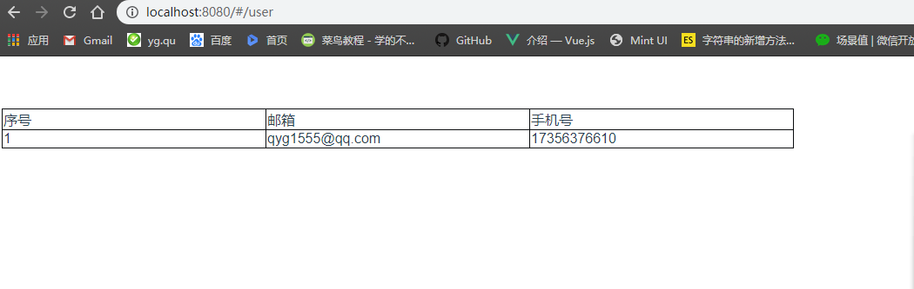
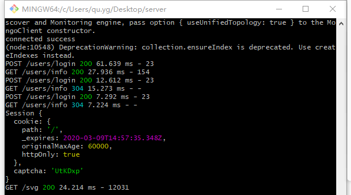

1.npm install      //安装依赖

2.npm run dev    //运行前端项目

node ./bin/www   //运行后端项目

如果error：cant found module 'array-includes' 删除node_modules  试试  npm clean cache --force  

并返回1

//一点改进

添加登录界面二维码(静态演示)

添加登录界面注册跳转

添加登录界面iconfont

添加数据库约束

修复验证码点击更新bug(我的电脑上没有)

